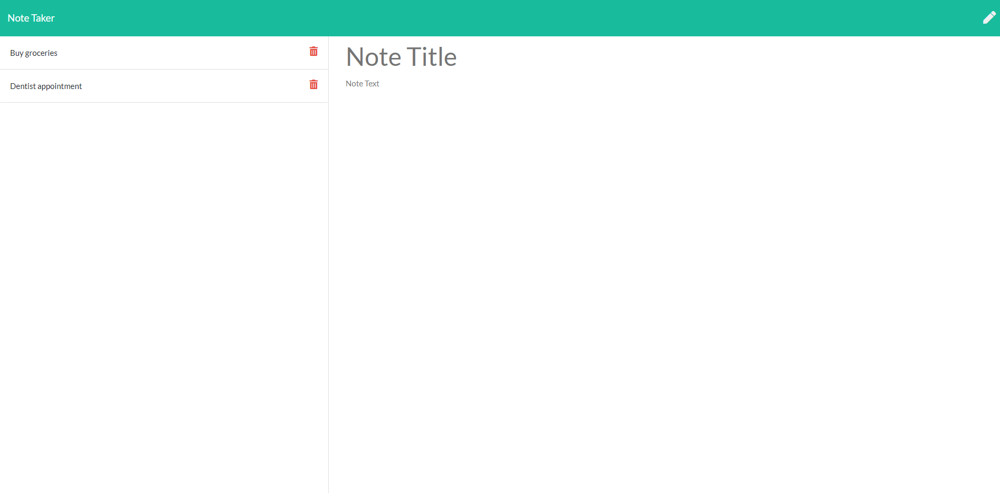

# Note Taker

## Description

This application lets the user write, save and delete notes such that he or she can keep track of their daily tasks or any todo items. 

From an implementation perspective, the backend uses a Node.js Express server. The data is stored in a json file which is also used to retrieve the notes upon user request. The frontend uses AJAX to do GET/POST/DELETE requests to the express server, parsing any returned contents as appropriate and updating the view.

Here is screenshot of the app:

## Instructions

The app is deployed using heroku [here](https://sheltered-plateau-59057.herokuapp.com/). Simply navigate to the URL!

## Usage

Browse to the [app URL](https://sheltered-plateau-59057.herokuapp.com/). Click on the Get Started button. Enter the note title and details and click on the save button to save the note. Once the note is saved, it will appear in the left pane where clicking on the title will show the note details. The note can be deleted via clicking on the trash can icon next to the note title.

## Tests

This app was tested manually with the help of postman.

## Future

This app does not allow for saving the notes per user which is a major limitation. This will be addressed in the future.

## Questions

My github username is @kambiz-frounchi and here is my [github profile](https://github.com/kambiz-frounchi).

Please direct all questions about this application to kambiz.frounchi@gmail.com.